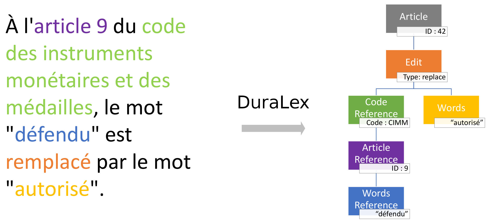

# DuraLex

[](https://travis-ci.org/Legilibre/duralex)
[](https://gitter.im/Legilibre/duralex)

DuraLex is an extensible French bill parsing and automating framework.
It turns bills written in plain natural French into an intermediary tree representation that can be automatically processed.

The main use case is the evaluation of the edits described by the bill to automagically apply them to the existing law texts.

## Installation

### Installing dependencies

```bash
pip install -r requirements.txt
```

### Fetching the original law texts

If you want to generate diffs, you will need to have the corresponding original law texts in the `data` directory.
This original data is expected to be a Git repositories created using  [Archeo-Lex](https://github.com/Legilibre/Archeo-Lex).

## Usage

```bash
usage: duralex [-h] [--file FILE] [--url URL] [--diff]

optional arguments:
  -h, --help   show this help message and exit
  --file FILE  the path of the bill to process
  --url URL    the URL of the bill to process
  --diff       compute a diff for each edit
```

Examples:

```bash
./duralex --file pion1561.html
```
```bash
./duralex --url http://www.assemblee-nationale.fr/14/propositions/pion1561.asp
```
```bash
curl -s http://www.assemblee-nationale.fr/14/propositions/pion1561.asp | ./duralex
```
```bash
cat http://www.assemblee-nationale.fr/14/propositions/pion1561.asp | ./duralex
```

## Intermediary representation

### Principle

DuraLex turns plain text into a standardized JSON tree structure intermediary representation.
This standardized intermediary representation can then be used as an input for other (third party) tools.



### Example

The following bill article:

```
L'article 11 de la loi n° 78-753 du 17 juillet 1978 portant diverses mesures d'amélioration des relations entre l'administration et le public et diverses dispositions d'ordre administratif, social et fiscal est abrogé.
```

will give the following intermediary representation:

```json
{
  "children": [
    {
      "children": [
        {
          "children": [
            {
              "children": [
                {
                  "id": "11",
                  "type": "article-reference"
                }
              ],
              "lawDate": "1978-7-17",
              "lawId": "78-753",
              "type": "law-reference"
            }
          ],
          "editType": "delete",
          "type": "edit"
        }
      ],
      "isNew": false,
      "order": 1,
      "type": "article"
    }
  ]
}
```

## Generating patch files

**Before generating patch files, you must fetch the corresponding original law texts. In order to do so, please read the ["Fetching the original law texts"](#fetching-the-original-law-texts) section.**

By default, the intermediary representation will not compute/feature the diff of each edit.
You must add the `--diff` switch to the command line:

```bash
./bin/duralex --diff articles.json
```

```json
{
  "children": [
    {
      "children": [
        {
          "children": [
            {
              "children": [
                {
                  "type": "quote",
                  "words": "autorisé"
                }
              ],
              "type": "words"
            },
            {
              "children": [
                {
                  "children": [
                    {
                      "children": [
                        {
                          "children": [
                            {
                              "type": "quote",
                              "words": "défendu"
                            }
                          ],
                          "type": "words-reference"
                        }
                      ],
                      "order": 1,
                      "type": "sentence-reference"
                    }
                  ],
                  "filename": "data/code des instruments monétaires et des médailles/9.md",
                  "id": "9",
                  "type": "article-reference"
                }
              ],
              "codeName": "code des instruments monétaires et des médailles",
              "type": "code-reference"
            }
          ],
          "diff": "--- \"data/code des instruments monétaires et des médailles/9.md\"\n+++ \"data/code des instruments monétaires et des médailles/9.md\"\n@@ -1,6 +1,6 @@\n # titre 1\n \n-Il est expressément défendu à toutes personnes, quelles que soient les professions qu'elles exercent, de frapper ou de faire frapper des médailles, jetons ou pièces de plaisir, d'or, d'argent et autres métaux, ailleurs que dans les ateliers de la monnaie, à moins d'être munies d'une autorisation spéciale du ministre de l'économie et des finances.\n+Il est expressément autorisé à toutes personnes, quelles que soient les professions qu'elles exercent, de frapper ou de faire frapper des médailles, jetons ou pièces de plaisir, d'or, d'argent et autres métaux, ailleurs que dans les ateliers de la monnaie, à moins d'être munies d'une autorisation spéciale du ministre de l'économie et des finances.\n \n # titre 2\n ",
          "editType": "replace",
          "type": "edit"
        }
      ],
      "isNew": false,
      "order": 1,
      "type": "article"
    }
  ]
}
```

Then, using [jq](https://stedolan.github.io/jq/), it is easy to extract only the `diff` fields:

```bash
./bin/duralex --file bill.html --diff | jq -r '.. | .diff? | strings'
```

```patch
--- "data/code des instruments monétaires et des médailles/9.md"
+++ "data/code des instruments monétaires et des médailles/9.md"
@@ -1,6 +1,6 @@
 # titre 1

-Il est expressément défendu à toutes personnes, quelles que soient les professions qu'elles exercent, de frapper ou de faire frapper des médailles, jetons ou pièces de plaisir, d'or, d'argent et autres métaux, ailleurs que dans les ateliers de la monnaie, à moins d'être munies d'une autorisation spéciale du ministre de l'économie et des finances.
+Il est expressément autorisé à toutes personnes, quelles que soient les professions qu'elles exercent, de frapper ou de faire frapper des médailles, jetons ou pièces de plaisir, d'or, d'argent et autres métaux, ailleurs que dans les ateliers de la monnaie, à moins d'être munies d'une autorisation spéciale du ministre de l'économie et des finances.

 # titre 2
```

Such output can be written in a patch file to be applied later:

```bash
./bin/duralex --file bill.html --diff | jq -r '.. | .diff? | strings' > articles.patch
```

or it can be piped to apply the patch directly:

```bash
./bin/duralex --file bill.html --diff | jq -r '.. | .diff? | strings' | patch -p0
```

## Tests

```bash
cd tests
python main.py
```

## Related projects

* https://github.com/Legilibre/NuitCodeCitoyen
* https://github.com/Legilibre/Archeo-Lex
